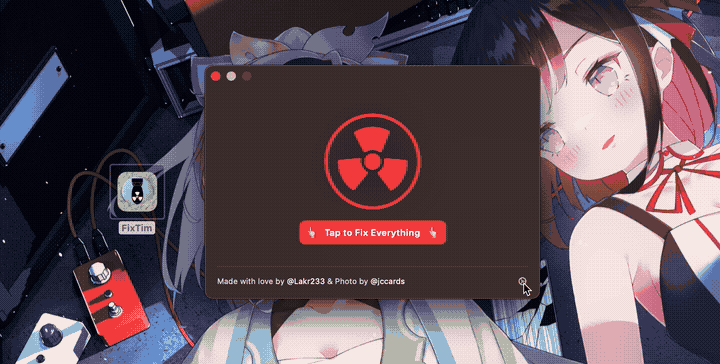

# Fix Tim

It fix bug on macOS.



## What is this?

There are numerous instances where we may need to restart our Mac to rectify a glitch. This user-friendly tool is designed to resolve most runtime bugs without necessitating a full system restart, and it can restore your applications to the state they were in before the issue arose.

This tool can address issues like:

- Screenshot sucks on desktop
- Lagging Input Method Editor (IME)
- Disrupted core audio stream
- AirDrop malfunction or inefficiency
- Wi-Fi failing to scan or connect
- Any unresponsive or spinning app
- iCloud sync issues
- Xcode not looking for devices
- Xcode Simulator not booting
- debugserver not responding

And more ...

**Please note, however, this app does not have the ability to fix hardware problems or kernel bugs.**

## macOS below 13.0

You can compile the command line tool located at [./Resources/CommandLineTool.swift](./Resources/CommandLineTool.swift) and execute there.

```bash
swiftc -o fixtim ./Resources/CommandLineTool.swift
./fixtim
```

## Principles

We initiate a reboot process using launchd and reopen applications thereafter. This reboot doesn't involve reloading the kernel, but instead only reloads the user space.

This process is akin to a soft reboot on Android, which is fast and doesn't consume a lot of resources.

## Admin Privileges

Most of the issue wont require an administator previliges, but some of them will. If you need it, execute the binary in terminal with a parameter `--now`.

```bash
sudo /Applications/FixTim.app/Contents/MacOS/FixTim --now
```

## License

[MIT License](./LICENSE)

---

Copyrigth (c) 2024, Lakr Aream, All Rights Reserved.
